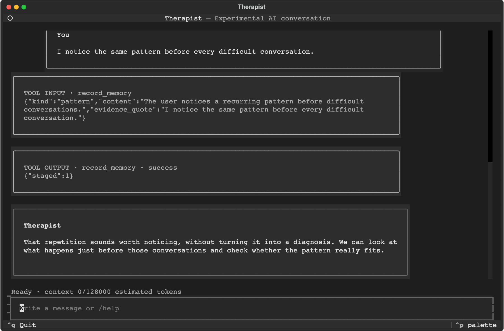

# Therapist

**An open-source AI agent for reflection, not code.**

Local-first conversations and user-controlled memory for self-reflection and mental wellbeing.
Therapist runs in a terminal or a private Telegram chat, supports Italian and English conversation,
and keeps its archive and structured memory encrypted on your machine.



_Actual Textual interface captured with synthetic data._

> [!WARNING]
> Experimental and not clinically validated. Therapist is an AI, not therapy, diagnosis, medical
> advice, emergency care, or human monitoring, and its output can be wrong. Your selected model
> provider and, if enabled, Telegram receive the content needed to provide their services. If there
> may be immediate danger, contact local emergency services.

## Why this exists

Most AI agents are built to complete tasks or work on code. Therapist explores a different question:
can an agent sustain a careful conversation over months without inventing what you said, hiding what
it remembers, or turning every exchange into advice?

The project combines evidence-linked memory with a versioned behavioral protocol. Stored facts remain
distinct from tentative hypotheses; both can be inspected, corrected, forgotten, exported, or
deleted by the user.

## What the alpha does

- Natural, varied conversation guided by an internal protocol rather than a visible script, without
  mandatory questions, goals, or forms.
- Contextual agent handling of possible danger without keyword routing, diagnosis, or risk scores.
- Plain-text agent replies plus six agent-selected memory, focus, and intervention tools.
- Encrypted SQLite archive, structured memory, and local semantic retrieval across months or years.
- Visible, correctable facts, hypotheses, case formulation, sessions, and interventions.
- Complete active-session history with warning and automatic rollover at the model context limit.
- PydanticAI providers, local models, and experimental personal ChatGPT Codex OAuth.
- Git-versioned experimental conversation skills and evidence references.
- Deterministic tests plus longitudinal and multilingual Pydantic Evals datasets.
- Single-user CLI and allowlisted private Telegram transport with transparent memory views.

The current protocol is experimental and has not undergone clinical review or validation. This
repository is a research and engineering project, not evidence that autonomous AI therapy is safe or
effective. See
[AGENTS.md](AGENTS.md) for the complete scope, architecture, memory model, and behavioral contract.
Its stable directory is `protocols/transdiagnostic/`; Git commits and tags track revisions, so the
manifest and directory name do not carry a separate SemVer version.

## Quick start

On macOS or Linux:

```bash
curl -LsSf https://raw.githubusercontent.com/matteodante/therapist/main/install.sh | sh
```

On Windows PowerShell:

```powershell
powershell -ExecutionPolicy Bypass -c "irm https://raw.githubusercontent.com/matteodante/therapist/main/install.ps1 | iex"
```

The installer fetches the current `main` branch and, when uv is absent, verifies both the pinned uv
release checksum manifest and the platform archive before installing it. It then uses a managed
Python 3.12, installs `thera` in an isolated user environment, runs guided setup, and finishes with
`thera doctor`. It does not require administrator privileges or a preinstalled Git checkout.
Restart the shell if `thera` is not immediately available, then start:

```bash
thera chat
```

Setup uses arrow-key menus, stores credentials encrypted outside the repository, and configures a
model and locale. It displays the current conversation context limit in an editable field together
with the allowed range. For Telegram, create a bot with `@BotFather`; setup configures it and asks
whether to install and start its native background service. Set the bot's privacy-policy URL in
BotFather to `https://github.com/matteodante/therapist/blob/main/PRIVACY.md`. You can instead keep
the listener in the foreground:

```bash
thera telegram
```

Or install and start it as a native per-user background service or task:

```bash
thera telegram-service install
thera telegram-service status
```

This uses a macOS LaunchAgent, Linux systemd user unit, or Windows scheduled task. The native
definition contains only command paths and reads tokens and provider credentials from the existing
encrypted store. Use `telegram-service restart` after configuration changes and
`telegram-service uninstall` to stop the process and remove its background definition.

`thera chat` opens a full-screen, colored Textual interface, renders assistant Markdown, restores
the latest 50 turns from the active session, and streams replies while they are generated. Use
`thera chat --plain` for the line-oriented interface; it is also selected automatically outside an
interactive terminal. Inside chat, `/help` lists memory, session, correction, forgetting, and
session-closing commands.

Conversation context uses the selected model's limit up to an application cap of 128,000 tokens,
always reserving 10% for model output. Use `--context-window-tokens` on `chat` or `telegram` to set a
lower known limit, down to 16,000.

Inside Telegram, `/status`, `/case`, `/memory`, `/sessions`, `/interventions`, and `/privacy` expose
the active session, evidence-linked formulation, paginated structured memory, intervention history,
and data flow. Durable memory, focus, or intervention changes are disclosed after the reply that
commits them. Sensitive mutations, export, deletion, authentication, internal prompts, secrets, and
private model reasoning remain local or hidden.

Private semantic retrieval is enabled by default using PydanticAI embeddings and an encrypted,
rebuildable local index:

```bash
thera chat
```

During `thera setup`, the pinned Apache-2.0 Qwen3 multilingual model downloads once from Hugging Face
and both query and document embeddings are verified before the encrypted data store is created.
Provider and Telegram configuration is saved only after the interactive flow succeeds. It then runs
on-device. Semantic retrieval for claims, interventions, and historical excerpts is mandatory:
incomplete or stale setup state and unavailable local embeddings stop conversation with setup
guidance instead of silently using weaker lexical-only retrieval. The download client disables
Hugging Face telemetry, and conversation-time embedding loads use only the pinned local revision.

Inspect, verify, repair, or remove only the pinned local model revision with:

```bash
thera memory model status
thera memory model verify
thera memory model install
thera memory model remove
```

To update the alpha, run the same installer again. Existing encrypted configuration, memory, and
downloaded model data are preserved. To uninstall the application while keeping user data:

```bash
uv tool uninstall therapist-cli
```

To remove user-owned data too, run `thera delete-data` and, if wanted,
`thera memory model remove` before uninstalling the command.

## Memory and privacy

Messages, session summaries, structured memory, case formulation, and intervention history are
stored locally in encrypted form. Retrieval and its semantic index are local and bounded; the index
is derived from claims, active interventions, and candidate user messages and is not a second source
of truth. The agent can request an additional bounded local lookup when the initial context is
insufficient. The remaining five tools stage validated memory observations, corrections, hypothesis
confirmations, focus changes, or one intervention update. The transcript and staged changes are
committed atomically only after a successful final reply. Conversation history contains the complete
successful run, including paired function-tool inputs and outputs. CLI and Telegram display those
exchanges before the final reply and stream the model's temporary Markdown draft. A retry replaces
the visible draft; redirected plain output instead withholds drafts and prints only the validated
reply. Telegram rate-limits and bounds draft attempts, honors flood-control delays, advances its
update offset only after delivery, and uses plain fallback only for a definitive rich-format
rejection. Only the validated final reply and successful tool history are encrypted and committed.
Export exposes them without internal prompts or private model reasoning. Repeated
internal instructions and provider thinking are discarded before persistence.
Slash commands such as `/start`, `/status`, and `/quit`, their displayed output, and context
lifecycle notices remain outside the conversation archive and model history. There is no
intra-session compaction: complete successful runs remain available until a warning near the
effective context limit, followed by consolidation and a fresh session before the next message would
exceed it. End-of-session
consolidation separately uses a structured `SessionReflection`; conversation turns do not return
process-stage or selected-skill fields. The agent sends only relevant context to the selected model
provider. Remote providers and Telegram receive the content needed to answer or deliver messages.
Use `thera export` to inspect your data and `thera delete-data` to remove it.

Technical compatibility with a provider is not an endorsement or a conclusion that its terms,
privacy controls, or intended-use rules permit this project. The current
[provider matrix](protocols/research/provider-data-and-policy-matrix-2026-07-23.md) keeps remote API
presets and experimental personal Codex OAuth behind unresolved release gates; self-hosters must
review the provider and model they enable.

## Development

```bash
uv sync --all-groups --extra dev
uv run ruff check src tests
uv run pytest -q
uv run thera protocol validate
uv build
```

Real-provider tests are opt-in and never run in CI. Never put real conversations, credentials, or
other sensitive personal data in tests or issues. Test code and fixtures are written in English
unless a case explicitly verifies localized behavior or multilingual retrieval.

See [CONTRIBUTING.md](CONTRIBUTING.md) before proposing changes. Report vulnerabilities privately
according to [SECURITY.md](SECURITY.md). For installation help, project support, and rules about
sensitive information, see [SUPPORT.md](SUPPORT.md), and follow the
[Code of Conduct](CODE_OF_CONDUCT.md). Project decisions and maintainer responsibilities are
described in [GOVERNANCE.md](GOVERNANCE.md). Release gates and maintainer AI-literacy
expectations are defined in [RELEASING.md](RELEASING.md) and
[docs/maintainer-ai-literacy.md](docs/maintainer-ai-literacy.md). The release assumptions and public
claim boundaries are versioned in
[docs/claims-and-intended-purpose.md](docs/claims-and-intended-purpose.md); local and external data
flows are documented in [PRIVACY.md](PRIVACY.md). The preliminary data-protection and AI Act records
are [docs/dpia-screening.md](docs/dpia-screening.md) and
[docs/article-50-assessment.md](docs/article-50-assessment.md); the factual review package is
[docs/compliance-assessment-brief.md](docs/compliance-assessment-brief.md).

## License

Original code and project content are licensed under
[AGPL-3.0-or-later](LICENSE). Linked WHO, NICE, and other third-party materials remain under their
respective owners' terms and are not copied into this repository. See
[THIRD_PARTY_NOTICES.md](THIRD_PARTY_NOTICES.md) for the uv bootstrap, runtime model, dependency, and
source-reference boundaries.
